



## Introduction 
Boundary layer theory developed by [Ludwig Prandtl](https://en.wikipedia.org/wiki/Ludwig_Prandtl) in 1904 is probably one of the most significant discoveries in fluid mechanics. Boundary layer theory is crucial to understand the near wall physics of wall-bounded flows, and to have an accurate description of the forces generated by the fluid on a solid surface. 

The reasons I put together this short course are the following:
1. I am very passionate about fluid mechanics and the physics of wall-bounded flows.
2. The derivation of boundary layer theory is mathematically elegant, rigorous, and very beautiful, but unfortunately in a regular "Introduction to fluid mechanics" course, there is no time to dive deeper into it. This course will give students a more complete understanding on how boundary layer theory was first developed, but also on how the first solution to it was found (by Blasius) using a very interesting approach.

## Prerequisites 

To take this course one must have a good understanding of basic calculus, and needs to have taken an introductory course in fluid mechanics where the concept of boundary layer was at least introduced. You will find my email on the website and you can reach out at any point if you have doubts or questions. HAVE FUN!!!

## What is the boundary layer?
The concept of Boundary Layer (BL) is crucial in fluid dynamics, in fact if the boundary layer  would not exist, it would be impossible for a fluid to generate forces on a body. **What is the boundary layer in the first place?** Let’s consider a uniform flow of velocity $U_\infty$ that hits a flat plate at $x=0$  as in the figure below:

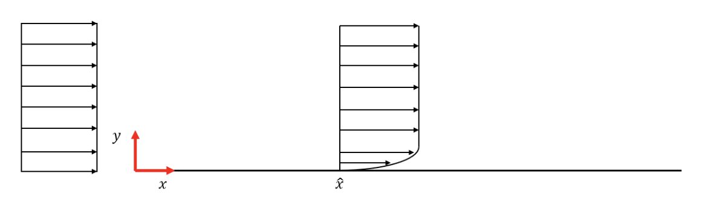
*Figure 1: Sketch of the streamwise velocity profile over a flat plate.*

Let’s also imagine we have a Pitot probe at position $\hat{x}$. By moving the Pitot tube from the free stream down towards the wall we can measure the velocity of the fluid with respect to the distance from the plate, and we can order the values in a table. What we will observe is something like this:

| Distance (m)     | Velocity ($u/U_\infty$)  |
| --------         |   ------- |
| 1                |    1    |
| 0.8              |    1   |
| ...              |   ??    |
| ...              |   ??    |
| 0                |   0     |

What we observe is that far enough from the flat plate, the velocity is exactly the same as the freestream velocity $U_\infty$, therefore we can say that the flow does not feel the presence of the wall. However, as we get closer to the wall the velocity will start decreasing. We know that because of the no-slip boundary condition that has to be valid at the wall ($y = 0$). The big question is: what happens between $y = 0.8$ and $y = 0$? We need to have some sort of function to connect these two points, and the boundary layer theory aims exactly at finding this function.

By sequentially lowering the position of the Pitot tube, we will reach a point (ex. 0.05m) where $u/U_\infty = 0.99$. From this point on, the velocity will keep decreasing until $u/U_\infty = 0.0$ at the wall. The thickness of the fluid layer in which we have the transition between $u/U_\infty = 0$ to $u/U_\infty = 0.99$ is defined as $\delta$, the boundary layer thickness. It is straight forward to think that as we move on the right of the flat plate, the quantity $\delta$ cannot be constant, we will find a spatial development as shown in figure 2. 

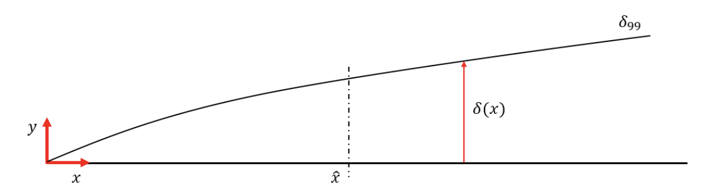
*Figure 2: Sketch of the streamwise development of the Boundary Layer.*

Above the line denoted as $\delta_{99}$, the velocity is always the free-stream velocity $U_\infty$, however, below the line the velocity must necessarily smooth until the value $u = 0$ at
the wall. Now let us focus on only one section of the boundary layer denoted as $\hat{x}$ in figure 2. The section is reported in detail in figure 3.

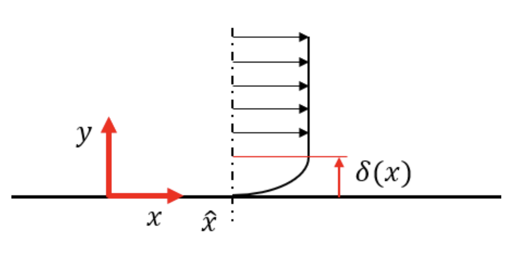
*Figure 3: Sketch of one section of the Boundary Layer.*

It is clear now that the concept of boundary layer thickness is a local definition
and it varies with the spacial location on the flat plate. Let’s write the conservation of linear momentum equation for an incompressible fluid with constant viscosity. Recall that this equation is a "vectorial" equation:

$$
\frac{\partial\overline{U}}{\partial t} + \overline{U}\cdot\nabla\overline{U} = -\frac{\nabla P}{\rho} + \frac{\mu}{\rho}\nabla^2\overline{U} + \mathcal{F}
$$

Where $\overline{u}$ is the velocity field defined as:

$$
\overline{U}(x,y,z,t) = u(x,y,z,t)\cdot\hat{i} + v(x,y,z,t)\cdot\hat{j} + w(x,y,z,t)\cdot\hat{k}
$$

$P$ is the fluid pressure, $\rho$ the density, and $\mu$ the dynamic viscosity. If we now suppose that the external force $\mathcal{F}$ is only the gravitational acceleration $\overline{g}=(0,0,-g\cdot\hat{k})$, what is exactly that makes the velocity profile to curve in the way pictured in the figure above? We will find out that the reason is: the viscous term. The viscosity which diffuses momentum between fluids layers, at a certain point will diffuse the information that the wall has a zero ($u = 0$) velocity. Therefore, we might ask ourselves: what if the viscosity is absent? The fluid should never know about the wall, and in fact the profile will look like a uniform one:

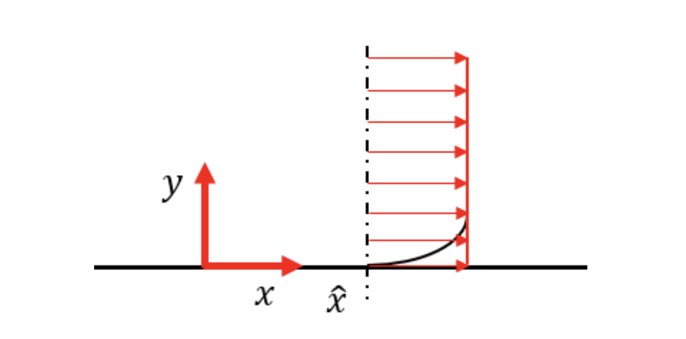
*Figure 4: Sketch of the streamwise velocity profile IF viscosity would be absent.*

Without viscosity, we should have the red velocity profile in the figure above and we would not be able to have the no slip boundary conditions. Now we defined, without doubts, that inside the boundary layer $y < \delta$ viscosity is indeed **very important**. 

Let us try to understand the importance of the term $\mu/\rho\nabla^2\overline{U}$ by plugging in some numbers. For instance, air has a density of about $\rho_{air}=1.22 kg/m^3$ at a standard pressure of $P_o = 10^5 Pa$ and standard temperature $T_o = 15 ^\circ C$. The kinematic viscosity is finally $\mu=1.8\cdot 10^{-5} N\cdot s/m^2$. The idea we can develop is: since each term of the equation presented above is multiplied by an unitary coefficient, we will end up having something like this:

$$
\frac{\partial\overline{U}}{\partial t} + \overline{U}\cdot\nabla\overline{U} = -\frac{\nabla P}{1.22} + 1.5\cdot 10^{-5}\nabla^2\overline{U} + \mathcal{F}
$$

We will be VERY tempted to conclude that the viscous term (multiplied by a factor of $1.5\cdot 10^{-5}$) is actually very small and it can be easily, and reasonably neglected. The temptation is even stronger if we make a comparison with the oscillatory equation. Let’s take the very simple case of spring and mass in a damped system, as represented in the figure below:

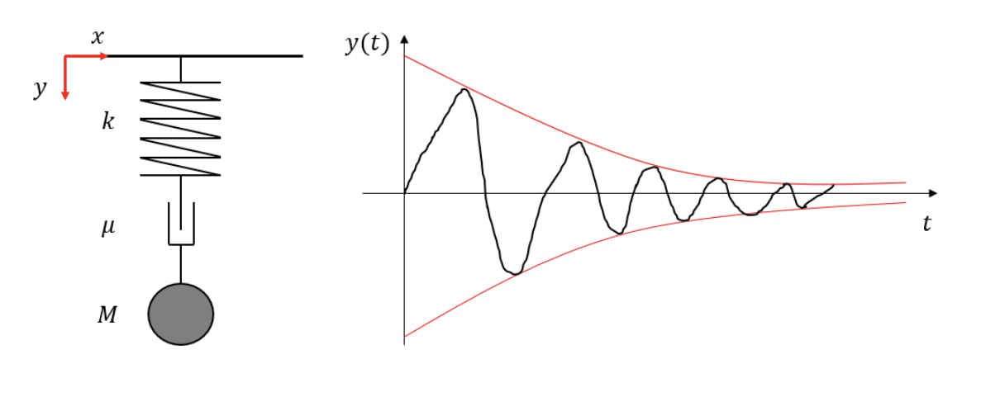
*Figure 5: Sketch of damped oscillatory motion.*

The equation that describes the mechanical system reads as follow:

$$
M\frac{d^2y}{dt^2} + \mu\frac{dy}{dt} + ky = 0
$$

We also know that the behavior of the system is like the one sketched in the panel on the right of figure 5, the oscillations will be damped down by "friction" ($\mu$). Now if we say that "friction", which plays the same role as viscosity in the fluid, is absent, the governing equation reduces to:

$$
M\frac{d^2y}{dt^2} + ky = 0
$$

We would still get the oscillatory behavior, but this time it will not be damped over time. **Will the same reasoning apply to a fluid too?**  Well ... this is where physics gives us a very hard slap! This would be a HUGE mistake. The fluid (momentum) equation as well as the damping system equation are second order differential equations. If in the momentum equation we set $\mu = 0$ we are getting rid of the highest order derivative. Therefore, by saying that $\mu = 0$ we are not changing the perturbations rather we are changing the physics. By taking a closer look, in the damping equation, $\mu$ is the coefficient of the first order derivative and $M$ is the coefficient of the second order derivative. Therefore, if we
neglect $M$, we will never get the oscillations, but only an exponential decay as shown in figure 6:

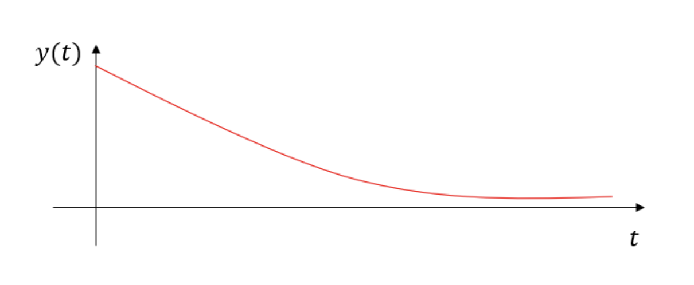
*Figure 6: Sketch of the exponential decay if $M = 0$*

## Prandtl discovery

In 1904 Prandtl showed that the term $\mu/\rho\nabla^2\overline{U}$ is not negligible at all, but rather dominant in the near-wall region. If we consider a flat plate of length $\mathcal{L}$, we can say that in the direction of the flow ($x$) the phenomenon will evolve in a scale $\mathcal{L}$. However, in the wall normal direction ($y$) the boundary layer thickness is $\delta << \mathcal{L}$. We will also have a velocity $u_x=u$ and $u_y=v$. What are the implications of the fact that the viscous term is not negligible? Let us project the momentum equation into the streamwise direction for a 2D flow:

$$
\dfrac{\partial u}{\partial t} + u\dfrac{\partial u}{\partial x} + v\dfrac{\partial u}{\partial y} = -\dfrac{1}{\rho}\dfrac{\partial P}{\partial x} + \dfrac{\mu}{\rho}\left(\textcolor{red}{\dfrac{\partial^{2}u}{\partial x^{2}}} + \textcolor{red}{\dfrac{\partial^{2}u}{\partial y^{2}}}\right)
$$

At least one of the two terms highlighted in red must have a comparable dimension with the other terms. Generally speaking $u=u\left(x,y,t\right)$. For now, we can consider the steady case (we will find out that all the conclusions we will obtain hold also in the non-steady case):

$$
u\dfrac{\partial u}{\partial x} + v\dfrac{\partial u}{\partial y} = -\dfrac{1}{\rho}\dfrac{\partial P}{\partial x} + \dfrac{\mu}{\rho}\left(\textcolor{red}{\dfrac{\partial^{2}u}{\partial x^{2}}} + \textcolor{red}{\dfrac{\partial^{2}u}{\partial y^{2}}}\right)
$$

Now, if we analyze the two terms in red:
- In the first case the changes in $x$ happen in a length scale $\mathcal{L}$
- In the second case the changes in $y$ happen in a scale $\delta$

Remember also that our assumption is that $\delta << \mathcal{L}$. Given this assumption we can conclude that:

$$
\dfrac{\partial^{2}u}{\partial x^{2}} << \dfrac{\partial^{2}u}{\partial y^{2}}\longrightarrow\quad \dfrac{L}{T}\dfrac{1}{L^{2}}<<\dfrac{L}{T}\dfrac{1}{\delta^{2}}\longrightarrow\quad L>>\delta
$$

Therefore, from the two terms, the second one ($\partial^{2}u/\partial y^{2}$) will be relevant. Same reasoning holds for the convective terms, we can ask which one is the dominant. Later on we will see that $u\partial u/\partial x$ and $v\partial u/\partial y$ are of the same "importance", but for now we can say that $u>>v$ and therefore:

$$
u\dfrac{\partial u}{\partial x} > v\dfrac{\partial v}{\partial y}
$$

Therefore, we found that the term that can be comparable (in magnitude) to $\partial^{2}u/\partial y^{2}$, inside the boundary layer we need:

$$
u\dfrac{\partial u}{\partial x} \approx \dfrac{\mu}{\rho}\dfrac{\partial^{2}u}{\partial y^{2}}
$$

In order to estimate the behavior of $u$ we can now proceed by carrying out estimates by orders of magnitude. We know the maximum velocity is $U_\infty$ and the minimum one is $0$. We can write:

$$
\Delta u\approx\partial u\approx U_\infty - 0\approx U_\infty\\
$$
$$
\Delta x\approx\partial x\approx \mathcal{L} - 0\approx\mathcal{L}
$$

And using this type of scaling we can derive that the order of magnitude of the convective term is:

$$
U_\infty\dfrac{U_\infty}{\mathcal{L}}\approx\dfrac{\mu}{\rho}\dfrac{U_\infty}{\delta^{2}}
$$

Finally, only using dimensional arguments we can find an expression for the boundary layer thickness $\delta$:

$$
\delta \approx \sqrt{\dfrac{\mu}{\rho}\dfrac{\mathcal{L}}{U_\infty}}
$$

By looking at the equation above, we can draw some conclusions:
- $\delta$ is directly proportional to the $\sqrt{\mathcal{L}}$
- $\delta$ is inversely proportional to  $\sqrt{\mathcal{U_\infty}}$ (if I double the velocity $\delta$ decreases by about 40%)
- $\delta$ is directly proportional to the $\sqrt{\nu}$

However, $\delta$ is a dimensional quantity and it is not very useful when analyzing different flows in different conditions. The non dimensional quantity $\delta/\mathcal{L}$ is much more interesting. 

$$
\dfrac{\delta}{\mathcal{L}}\approx\sqrt{\dfrac{\mu}{\rho U_\infty\mathcal{L}}}\quad\longrightarrow\quad\dfrac{\mu}{\rho U_\infty\mathcal{L}}=\dfrac{1}{Re}
$$
$$
\dfrac{\delta}{\mathcal{L}}\approx\dfrac{1}{\sqrt{Re}}
$$

The ratio $\delta/\mathcal{L}$ is not a constant number, but depends on the Reynolds number. The idea that the viscous terms are only important within the boundary layer becomes problematic because we stated that in order to apply the boundary layer theory we assume $\delta<<\mathcal{L}$, however now we see that $\delta<<\mathcal{L}$ **only if the Reynolds number is very large**.

What we have just found will help us go further with our estimates. For example, we can estimate how much the streamwise velocity $u$ is larger than the wall normal one $v$. In fact, from mass conservation:

$$
\nabla\cdot\overline{u} = 0
$$
$$
\dfrac{\partial u}{\partial x} + \dfrac{\partial v}{\partial y} = 0
$$

The two terms above needs to be of the same order of magnitude, therefore:
$$
\left|\dfrac{\partial u}{\partial x}\right|\approx\left|\dfrac{\partial v}{\partial y}\right|
$$
$$
\dfrac{U_\infty}{\mathcal{L}}\approx\dfrac{V}{\delta}
$$
$$
\textcolor{red}{V\approx\dfrac{U_\infty\delta}{\mathcal{L}}= U_\infty\dfrac{1}{\sqrt{Re}}}
$$

Not only we have that $\delta<<\mathcal{L}$, but we also derived that the velocity in the wall normal direction $y$ will be $v << u$ by a factor of $1/\sqrt{Re}$. This is why we are again very tempted on saying that this fluid layer is somehow negligible. However, what are the real implications of the existence of the boundary layer? We can first derive what is the wall shear stress, keeping in mind that a stress is a force over an area we can write:

$$
\tau_{w}=\mu\frac{\partial u}{\partial y}_{y=0}\approx \mu\frac{U}{\delta}
$$

$$
\dfrac{\delta}{\mathcal{L}}=\dfrac{1}{\sqrt{Re}}
$$

$$
\delta=\dfrac{\mathcal{L}}{\sqrt{Re}}
$$

$$
\tau_{w} = \mu\dfrac{U_\infty}{\mathcal{L}}\sqrt{Re} = \mu\dfrac{U_\infty}{\mathcal{L}}\sqrt{\dfrac{\rho U_\infty\mathcal{L}}{\mu}} = \textcolor{red}{\sqrt{\dfrac{\mu U_\infty^{3}\rho}{\mathcal{L}}}}
$$

The wall shear stress is not constant, but it is smaller the shorter the length of the flat plate. By replacing $\mathcal{L}$ with the $x$ coordinate along the plate, we can write:

$$
\tau_{w}\left(x\right)=\sqrt{\dfrac{\rho U_\infty^{3}\mu}{x}}
$$

This is a very important finding that will lead us towards the definition of friction force itself. What is the friction force? The friction force acting on the plate $\mathcal{F}_{\nu}$ is defined as:

$$
\int_{S}\tau_{w}\left(x\right)dS = \int_{0}^{b}\int_{o}^{\mathcal{L}}\tau_{w}dxdz
$$

Where in the equation above $b$ represents the extension of the flat plate inside the paper (in the spanwise direction $z$). Finally we can get:

$$
\overline{\mathcal{F}}=b\int_{o}^{\mathcal{L}}\tau_{w}dx = b\sqrt{\rho U_{\infty}^{3}\mu} \cdot 2\sqrt{\mathcal{L}}
$$

We have just found that the friction force $\mathcal{F}$ does not depend on $b$ and $\mathcal{L}$ in the same way. The dependence is linear in $z$ but NON linear in $x$. Usually, we are more interested in the non dimensional counterpart of the friction force: the friction coefficient $C_{f}$:

$$
C_{f} = \dfrac{\overline{\mathcal{F}}}{\dfrac{1}{2}\rho U_\infty^{2}b\mathcal{L}} = \dfrac{4\sqrt{\rho\mu U_\infty^{3}}\sqrt{\mathcal{L}}}{\rho U_\infty^{2}\mathcal{L}} = 4\sqrt{\dfrac{\mu}{\rho U_\infty\mathcal{L}}} = \textcolor{red}{4\dfrac{1}{\sqrt{Re}}}
$$

When the Reynolds number is very high (in the validity of the boundary layer theory) the skin friction coefficient $C_{f}$ is very small, which does not imply that the viscous force is necessarily also small.

## BL equations

In this section we will derive the set of equations for the boundary layer approximation first discovered by Ludwig Prandtl in 1904. Let us just remember the concept of boundary layer with a simple but instructive figure:

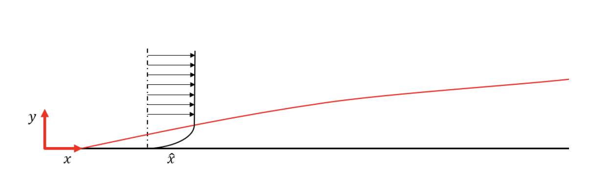
*Figure 7: sketch of the streamwise velocity profile over a flat plate. The red line indicates the streamwise development of the boundary layer thickness.*

We can also interpret the boundary layer as the diffusion in the fluid of the momentum deficit caused by the presence of the wall. This deficit will diffuse in the direction of the gradient (changing), since the gradient is on the wall normal direction y, this means that the more we move to the right in the flat plate, the more this deficit would diffuse inside the fluid in the $y$ direction. 

IMPORTANT: Theoretically speaking, the Navier-Stokes equations have also an elliptic type of behavior, which means that what happens at $t-\Delta t$ can actually influence what happens at $t+\Delta t$. The most correct way of saying it is: the boundary layer theory DOES NOT hold at $x\approx 0$ the leading edge, because the gradients in $x$ and the gradients in $y$ have the same order of magnitude.

Now we will start from the Navier-Stokes equations and we will see what kind of simplifications we can have by considering the boundary layer theory. Let us consider the following hypothesis:
- 2D and steady flows.
- Stationary plate.
- Incompressible flow, constant viscosity

We will also see that these hypothesis are not restrictive and that all our derivations will also hold in the $3D$, non stationary and compressible case. The conservation of mass equation along with the momentum conservation equations, read as follow:

$$
\nabla\overline{U} = 0
$$

$$
\overline{U}\cdot\nabla\overline{U} = -\dfrac{1}{\rho}\nabla P+\dfrac{\mu}{\rho}\nabla^{2}\overline{U} + \cancel{\overline{\mathcal{F}}}
$$

In the momentum equation the force $\overline{\mathcal{F}}$ is absent, not because is not there, but because it is balanced by the pressure. We also know that in the $2D$ case (as by hypothesis) $\overline{U} = \left(u,v\right)$ and $\overline{x} = \left(x,y\right)$. Therefore we can write both equations per component:

$$
\dfrac{\partial u}{\partial x} + \dfrac{\partial v}{\partial y} = 0
$$

$$
u\dfrac{\partial u}{\partial x} + v\dfrac{\partial u}{\partial y} = -\dfrac{1}{\rho}\dfrac{\partial P}{\partial x} + \nu\left(\dfrac{\partial^{2}u}{\partial x^{2}} + \dfrac{\partial^{2}u}{\partial y^{2}}\right)
$$

$$
u\dfrac{\partial v}{\partial x} + v\dfrac{\partial v}{\partial y} = -\dfrac{1}{\rho}\dfrac{\partial P}{\partial y} + \nu\left(\dfrac{\partial^{2}v}{\partial x^{2}} + \dfrac{\partial^{2}v}{\partial y^{2}}\right)
$$

The system of equations is closed because we have 3  equations in 3 unknowns ($u$,$v$,$P$). In the $3D$, non stationary, and compressible case everything is still valid but the mathematical derivation is more complicated. If the flat plate is of length $\mathcal{L}$ we know that under the boundary layer approximation $\delta<<\mathcal{L}$, and previously  we discovered that:

$$
\delta\approx\dfrac{\mathcal{L}}{\sqrt{Re}}\quad\longrightarrow\quad Re=\dfrac{\rho U_\infty\mathcal{L}}{\mu}
$$

Now, "very small" "very big", are all very confusing concepts in physics but let's just say that in our case, much larger than $1$ does not mean $10$ or $50$, but rather $10^{6}$ or $10^{8}$. We also concluded that $v << u$, expecting the flux to be mainly in the streamwise $x$ direction, and more precisely we found that:

$$
v \approx\dfrac{U_\infty}{\sqrt{Re}}
$$

Now we are going to scale the equation of motion term by term in order to make those equations non dimensional and we will see how they will change form. The reason for doing this is to ensure that inside the boundary layer, all the quantities will vary between $0-1$. This idea was maybe one of the best ideas of Ludwig Prandtl. Basically, he understood that inside the boundary layer $y<\delta$ non dimensional arguments are required because the quantities DO NOT vary in the same way. In the following section we will refer to the non dimensional quantity with an "hat" ($\hat{.}$) sign.

$$
\hat{u}=\textcolor{red}{\dfrac{u}{U_\infty}}\quad\longrightarrow\quad 0<\hat{u}<1
$$

$$
\hat{x}=\textcolor{red}{\dfrac{x}{\mathcal{L}}}\quad\longrightarrow\quad 0<\hat{x}<1
$$

$$
\hat{v}=\dfrac{v}{\mathcal{V}}=\textcolor{red}{\dfrac{v}{U_\infty}\sqrt{Re}}\quad\longrightarrow\quad 0<\hat{v}<1
$$

$$
\hat{y}=\dfrac{y}{\delta}=\textcolor{red}{\dfrac{y}{\mathcal{L}}\sqrt{Re}}\quad\longrightarrow\quad 0<\hat{y}<1
$$

All the red quantities are now non dimensional, but what about pressure? It is given by the flow moving in the $x$ direction, therefore:

$$
\hat{P} = \textcolor{red}{\dfrac{P}{\rho U_\infty^{2}}}\quad\longrightarrow\quad 0<\hat{P}<1
$$

Now we are going to plug the new non dimensional quantities we have just derived into the mass and momentum eqautions we previously derived to get their non-dimensional counterparts:

$$
\dfrac{\partial u}{\partial x} + \dfrac{\partial v}{\partial y} = 0
$$

$$
\dfrac{U_\infty}{\mathcal{L}}\dfrac{\partial\hat{u}}{\partial\hat{x}} + \dfrac{U_\infty}{\cancel{\sqrt{Re}}}\dfrac{\cancel{\sqrt{Re}}}{\mathcal{L}}\dfrac{\partial\hat{v}}{\partial\hat{y}} = 0
$$

$$
\dfrac{\partial \hat{u}}{\partial\hat{x}} + \dfrac{\partial \hat{v}}{\partial \hat{y}} = 0
$$

The conservation of mass equation written in a non dimensional form is not changed from it's original form. Let us now analyze the $x$  momentum component:

$$
\quad U_\infty\dfrac{U_\infty}{\mathcal{L}}\hat{u}\dfrac{\partial\hat{u}}{\partial\hat{x}}+\dfrac{U_\infty^{2}}{\mathcal{L}}\dfrac{\sqrt{Re}}{\sqrt{Re}}\hat{v}\dfrac{\partial\hat{u}}{\partial\hat{y}} =
$$

$$
= -\dfrac{1}{\rho}\dfrac{\rho U_\infty^{2}}{\mathcal{L}}\dfrac{\partial\hat{P}}{\partial\hat{x}}+\dfrac{\mu}{\rho}\left(\dfrac{U_\infty}{\mathcal{L}^{2}}\dfrac{\partial^{2}\hat{u}}{\partial\hat{x}^{2}}+\dfrac{U\cdot Re}{\mathcal{L}^{2}}\dfrac{\partial^{2}\hat{u}}{\partial\hat{y}^{2}}\right)
$$

And the $y$ momentum component:

$$
\dfrac{U_\infty^{2}}{\mathcal{L}\sqrt{Re}}\hat{u}\dfrac{\partial\hat{v}}{\partial\hat{x}} + \dfrac{U_\infty^{2}\sqrt{Re}}{\mathcal{L}Re}\hat{v}\dfrac{\partial\hat{v}}{\partial\hat{y}} =
$$

$$
= -\dfrac{1}{\rho}\dfrac{\rho U_\infty^{2}\sqrt{Re}}{\mathcal{L}}\dfrac{\partial\hat{P}}{\partial\hat{y}}+\dfrac{\mu}{\rho}\left(\dfrac{U_\infty}{\sqrt{Re}\mathcal{L}}\dfrac{\partial^{2}\hat{v}}{\partial\hat{x}^{2}} + \dfrac{U_\infty Re}{\sqrt{Re}\mathcal{L}}\dfrac{\partial^{2}\hat{v}}{\partial\hat{y}^{2}}\right)
$$

Dividing the x) momentum equation by the quantity $U_\infty^{2}/\mathcal{L}$ we obtain:

$$
\hat{u}\dfrac{\partial\hat{u}}{\partial\hat{x}} + \hat{v}\dfrac{\partial\hat{u}}{\partial\hat{y}} =
$$

$$
= -\dfrac{\partial\hat{P}}{\partial\hat{x}} + \dfrac{\mathcal{L}}{U_\infty^{2}}\dfrac{\mu}{\rho}\left(\dfrac{U_\infty}{\mathcal{L}}\dfrac{\partial^{2}\hat{u}}{\partial\hat{x}^{2}} + \dfrac{U_\infty Re}{\mathcal{L}}\dfrac{\partial^{2}\hat{u}}{\partial\hat{y}^{2}}\right)
$$

$$
\hat{u}\dfrac{\partial\hat{u}}{\partial\hat{x}} + \hat{v}\dfrac{\partial\hat{u}}{\partial\hat{y}} =
$$

$$
= -\dfrac{\partial\hat{P}}{\partial\hat{x}} +\dfrac{\mu}{\rho U_\infty\mathcal{L}}\left(\dfrac{\partial^{2}\hat{u}}{\partial\hat{x}^{2}} + Re\dfrac{\partial^{2}\hat{u}}{\partial\hat{y}^{2}}\right)
$$

And finally to the from:

$$
\hat{u}\dfrac{\partial\hat{u}}{\partial\hat{x}} + \hat{v}\dfrac{\partial\hat{u}}{\partial\hat{y}} = -\dfrac{\partial\hat{P}}{\partial\hat{x}} + \textcolor{red}{\dfrac{1}{Re}\dfrac{\partial^{2}\hat{u}}{\partial\hat{x}^{2}}} + \dfrac{\partial^{2}\hat{u}}{\partial\hat{y}^{2}}
$$

In the equation equation above the term highlighted is negligible because we are under the assumption that the Reynolds number is very large. Therefore, neglecting that term and omitting the $\hat{.}$ for the sake of simplicity, the $x$ momentum equation will read as follow:

$$
u\dfrac{\partial u}{\partial x} + v\dfrac{\partial u}{\partial y} = -\dfrac{\partial P}{\partial x} + \dfrac{\partial^{2}u}{\partial y^{2}}
$$

This equation tells us very important information:
1. First of all the convective terms are of the same order of magnitude (conclusion that we anticipated in the previous section).
2. $\partial P/\partial x$ is as important as all the other terms.
3. The viscous term $\partial^{2}u/\partial y^{2}$ is not negligible at all!!

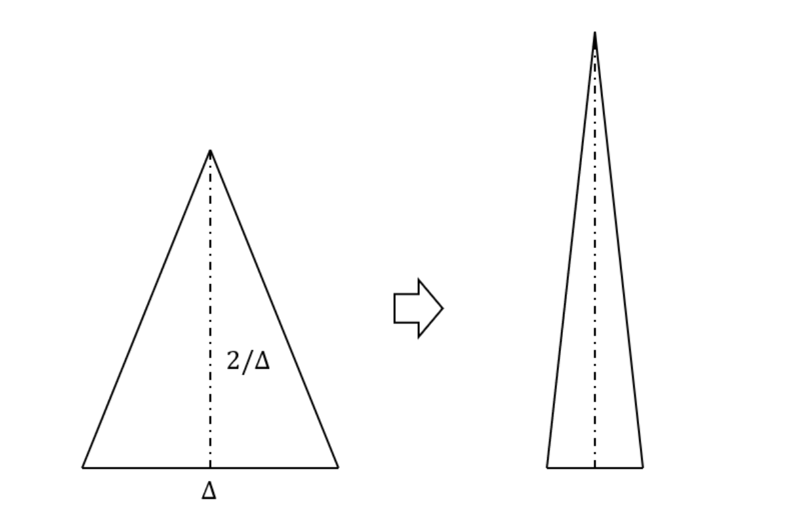
*Figure 8: geometrical comparison to the viscous term: the area of the triangle does
not change no matter how much the base gets smaller.*

We can try to visualize this important conclusion with a geometric argument shown in figure 8: let's take a triangle of base $\Delta$ and height $2/\Delta$ . What is the area $A$ of this triangle in the limit $\Delta\longrightarrow 0$? I am sure the first answer in your mind is ("The triangle will shrink therefore the area will tend to zero"). However, if we write down the formula for the area:

$$
A = \dfrac{1}{2}\dfrac{2\Delta}{\Delta} = 1
$$

So, no matter how much I will shrink the triangle, the area will always be $1$. This is exactly the same thing that happens to the viscous term in the boundary layer. **No matter how large the Reynolds number is, inside the boundary layer the viscous therm will always have the same importance.**

Now let's analyze the $y$ momentum equation in the exact same way. Dividing the $y$ momentum equation by the quantity $U_\infty^{2}/\sqrt{Re}\mathcal{L}$ we obtain:

$$
\hat{u}\dfrac{\partial\hat{v}}{\partial\hat{x}} + \hat{v}\dfrac{\partial\hat{v}}{\partial\hat{y}} = -Re\dfrac{\partial\hat{P}}{\partial\hat{y}} + \textcolor{red}{\dfrac{1}{Re}\dfrac{\partial^{2}\hat{v}}{\partial\hat{x}^{2}}} + \dfrac{\partial^{2}\hat{v}}{\partial\hat{y}^{2}}
$$

$$
\hat{u}\dfrac{\partial\hat{v}}{\partial\hat{x}} + \hat{v}\dfrac{\partial\hat{v}}{\partial\hat{y}} = -Re\dfrac{\partial\hat{P}}{\partial\hat{y}} + \dfrac{\partial^{2}\hat{v}}{\partial\hat{y}^{2}}
$$

If we take a closer look at this equation, if we want the pressure term $\partial\hat{P}/\partial\hat{y}$ to stay in the equation, it has to have the same order of magnitude as the other terms which means:

$$
\dfrac{\partial\hat{P}}{\partial\hat{y}}\approx\dfrac{1}{Re}
$$

Given the assumption of very large Reynolds number, this leads to the fact that inside the boundary layer we have:

$$
\dfrac{\partial\hat{P}}{\partial\hat{y}}\approx 0
$$

This also means that the Pressure is only function of $x$ $P=P\left(x\right)$. In the hypothesis of boundary layer ($\delta<<\mathcal{L}$ or $Re >> 1$) and remembering that we are analysing the $2D$ case, we can rewrite the two equations ($x$ and $y$ momentum) in the following way:

$$
x)\quad u\dfrac{\partial u}{\partial x} + v\dfrac{\partial v}{\partial y} = -\dfrac{dP}{dx} + \dfrac{\partial^{2}u}{\partial y^{2}}
$$

$$
y)\quad \dfrac{\partial P}{\partial y}\approx 0\quad\longrightarrow\quad P=P\left(x\right)
$$

STOP 1 MINUTE and observe its beauty. **This is Prandtl system of equations for the boundary layer**.

Let's look at some advantages:
1. The regular momentum equation contains both $\mu$ and $\rho$, which means that if we change fluid we have to solve the system again, on the other hand **boundary layer equations are universal**.
2. Regular momentum equations have an elliptic behavior. **Boundary layer equations are of parabolic type** which means that if we are inside the boundary layer what happens at location $x_{i}$ only depends on what happens at location $x_{i-1}$.
3. **The viscous term is independent on the Reynolds number** which means that inside the boundary layer, no matter how thin, the term $\partial^{2}u/\partial y^{2}$ will be always of the same importance.
4. **The pressure only varies in $x$**, not on the wall normal direction $y$. Therefore, the pressure inside of the boundary layer is given by the pressure at the edge of the boundary layer.

As we discovered previously, a very important feature of the boundary layer is that the viscous term is independent of the Reynolds number $Re$. This means that, inside the boundary layer, no matter how thin, the viscous term will always have the same importance. Also, the pressure $P$ inside the boundary layer does not vary in the wall normal direction. This means that, given a position $\hat{x}$ on the flat plate, $P=constant$ and the pressure will be given by its value outside (or at the edge) of the boundary layer (as sketched in the figure below).

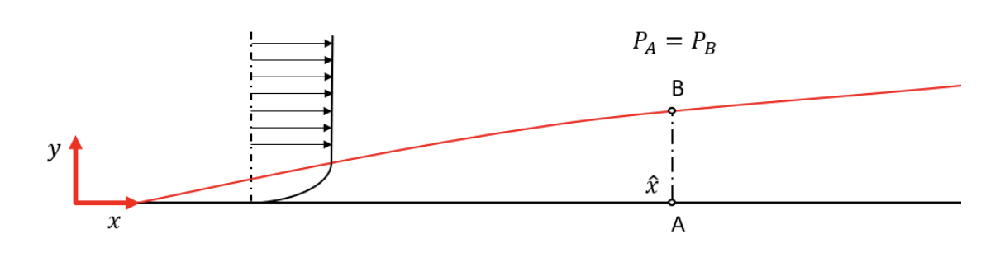
*Figure 9: sketch of the streamwise velocity profile over a flat plate. The red line indicates the streamwise development of the boundary layer thickness. The pressure at one section $\hat{x}$ at the wall (A) is the same as the pressure in the same location at the edge of the boundary layer (B).*

## Real world application
With the present knowledge we can understand more in depth how the Pitot tube works when measuring the velocity in a given flow. Let's say we have a Pitot probe as sketched in the figure below:

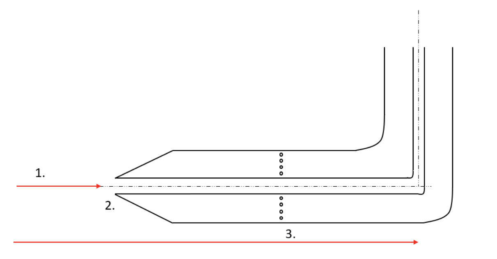
*Figure 10: Sketch of a Pitot probe in a given fluid. Point 1. represents the stagnation
streamline, point 2. represents where the stagnation pressure is measured, point 3.
represent the free stream streamline and the little circles represent where the static
pressure is measures.*

The assumptions here are that when the fluid hits the Pitot probe at point 2 has a velocity $U_{o}$ and a pressure $P_{o}$. The stagnation streamline in point 1 has a velocity $0$ and point 2 represents the location where the stagnation pressure (the pressure that needs to be applied to the fluid in order to stop it) is measured. We also assume that there is another streamline, represented by point 3  which is not stopped by the Pitot probe (of pressure $P_{o}$). Therefore, this streamlines carries the value of the pressure $P_{o}$. We can ask ourselves: is it correct to measure the static pressure at the wall of the Pitot tube? Is it representative of the free stream pressure? Well, now we can say that BECAUSE OF the existence of the boundary layer **that is indeed the pressure at the free stream**.

## The Blasius solution

Until now, we never quantified the boundary layer thickness $\delta\left(x\right)$. We only know it is the locus of points where the stream velocity $u$ is $u=0.99 U_\infty$. Remember: if we would not have the no slip condition at the solid wall, the velocity will always be the free stream velocity $U_\infty$, even at the wall. Therefore we have that in the boundary layer:

$$
u < U_\infty
$$

If we integrate the velocity profile in the wall normal direction we obtain:

$$
\int_{0}^{h}u dy \leq\int_{0}^{h}U_\infty dy \quad\quad\quad (1)
$$

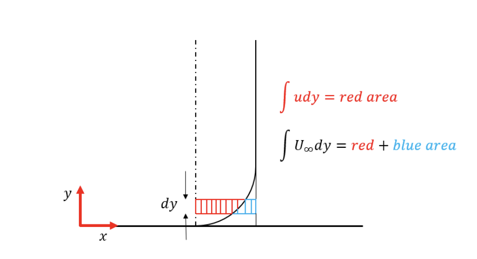
*Figure 11: Sketch of the streamwise velocity profile over a flat plate. The geometrical meaning of the velocity deficit at the wall.*

Equation (1) is geometrically sketched in figure 11, but now the question is: how do we make those two integrals equal to each other? Imagine if we have a certain distance defined as $\delta^{*}$ such that:

$$
\int_{0}^{h}u dy =\int_{\delta^{*}}^{h}U_\infty dy
$$

We want to find this distance. $u dy$ represents the infinitesimal mass flow rate through that surface $dy$, and $U_\infty dy$ will be the mass flow rate produced by the uniform free stream flow. Since $\delta^{*}>0$ we are literally saying: what is the distance I have to move the wall upwards in order to have the same mass flow rate as the free stream flow?

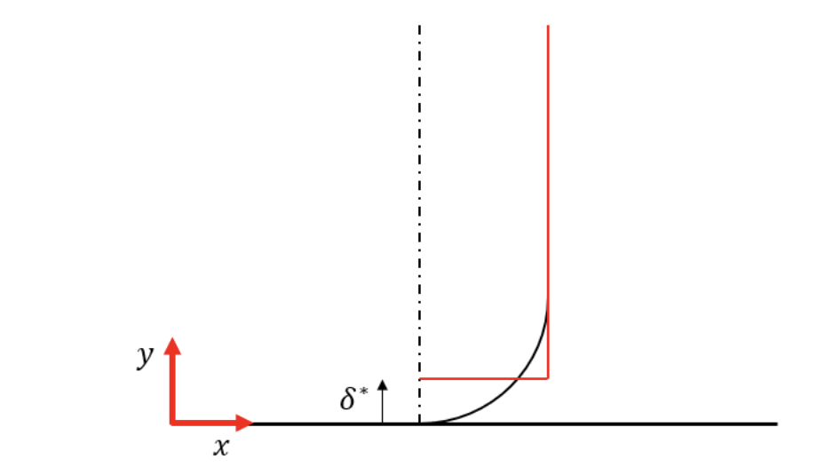
*Figure 12: Sketch of the streamwise velocity profile over a flat plate. The geometrical meaning of the displacement thickness*

As sketched in figure 12, $\delta$ (star) represents the distance you have to displace the wall up if you want to conserve the mass flow rate. $\delta^{*}$ is also defined as displacement thickness and it is an integral quantity of the boundary layer. With a little bit of algebra we can derive a definition for the displacement thickness:

$$
\int_{\delta^{*}}^{h}U_\infty dy = \int_{0}^{h}u dy
$$

$$
U_\infty h - U_\infty\delta^{*} = \int_{0}^{h}u dy
$$

$$
U_\infty\delta^{*} = U_\infty h - \int_{0}^{h}u dy
$$

$$
U_\infty\delta^{*} = \int_{0}^{h}U_\infty dy - \int_{0}^{h}u dy
$$

$$
U_\infty\delta^{*} = \int_{0}^{h}\left(U_\infty-u\right)dy
$$

$$
\delta^{*} = \int_{0}^{h}\left(1-\dfrac{u}{U_\infty}\right)dy
$$

We don't know what $h$ is, but we know that $h>>\delta$. We also know that once we reach the edge of the boundary layer $u=U_\infty$ therefore the integral in the equation above goes to zero. We can finally write the definition of the displacement thickness $\delta^{*}$ as:

$$
\delta^{*} = \int_{0}^{\infty}\left(1-\dfrac{u}{U_\infty}\right)dy \quad\quad (2)
$$

Equation 2  has no input from the user in it, it is completely given by the flow physics. Now, since the flow is slower close to the wall compared with the ideal (uniform) situation, there will also be a momentum deficit. As we did for the displacement thickness we can ask ourselves: at what distance from the wall, I can compensate the momentum deficit? This distance is defined as "momentum thickness" $\theta$, and given by:

$$
\theta = \int_{0}^{\infty}\dfrac{u}{U_\infty}\left(1-\dfrac{u}{U_\infty}\right)dy
$$

Inside the boundary layer we have the validity of the Prandtl equations. $\partial P/\partial y\approx 1/Re$, the pressure does not depend on the wall normal direction, and the Navier Stokes equation (in the steady $2D$ case) reduced to:

$$
\dfrac{\partial u}{\partial x} + \dfrac{\partial v}{\partial y} = 0
$$

$$
u\dfrac{\partial u}{\partial x} + v\dfrac{\partial u}{\partial y} = -\dfrac{1}{\rho}\dfrac{dP_\infty}{dx} + \dfrac{\mu}{\rho}\dfrac{\partial^{2}u}{\partial y^{2}}
$$

In the momentum equation the pressure term $P$ has been substituted with $P_\infty$ because the pressure inside the boundary layer is given by the pressure in the free stream. Now, let's suppose we have a flow parallel to the plate BUT outside of the boundary layer.

$$
u\dfrac{\partial u}{\partial x} + \cancel{v\dfrac{\partial u}{\partial y}} = -\dfrac{1}{\rho}\dfrac{dP_\infty}{dx} + \cancel{\dfrac{\mu}{\rho}\dfrac{\partial^{2}u}{\partial y^{2}}}
$$

We know that outside of the boundary layer $v=0$ and the effect of viscosity is absent. We also know that in the free stream $u=U_\infty$, therefore we can rewrite the equation above as:

$$
U_\infty\dfrac{d U_\infty}{dx} = -\dfrac{1}{\rho}\dfrac{dP_\infty}{dx}
$$

Finally we can rewrite Prandtl system of equations by substituting the pressure term with the derived equation.

$$
\dfrac{\partial u}{\partial x} + \dfrac{\partial v}{\partial y} = 0
$$

$$
u\dfrac{\partial u}{\partial x} + v\dfrac{\partial u}{\partial y} = U_\infty\dfrac{d U_\infty}{dx} + \dfrac{\mu}{\rho}\dfrac{\partial^{2}u}{\partial y^{2}}
$$

The big question now is: can we actually solve these equations? Generally speaking is not possible to find an analytical solution (pen and paper). However, we can introduce some assumptions that will make our life a lot easier. This is exactly what Blasius, Prandtl student, did when he presented his solution to the boundary layer equations in 1908. Let's first introduce some intermediate variables.

#### The stream function
The sream function is a scalar function very useful in fluid dynamics bacause its derivatives are related to the velocity components. The stream function is defined for a $2D$ flow with two velocity components $u\left(x,y\right)$ and $v\left(x,y\right)$.  It is denoted with the greek letter $\Psi\left(x,y\right)$ and it is defined as:

$$
\dfrac{\partial\Psi}{\partial y} = u\quad\longrightarrow\quad -\dfrac{\partial\Psi}{\partial x} = v
$$

One of the most important advantages of introducing the stream function is that, a flow derived from the stream function, automatically satisfies the conservation of mass equation. Let's see if this is true:

$$
\dfrac{\partial u}{\partial x} + \dfrac{\partial v}{\partial y} = 0\quad\longrightarrow\quad \dfrac{\partial}{\partial x}\dfrac{\partial\Psi}{\partial y} - \dfrac{\partial}{\partial y}\dfrac{\partial\Psi}{\partial x} = 0
$$

Using the Swartz theorem:

$$
\dfrac{\partial}{\partial x}\dfrac{\partial\Psi}{\partial y} - \dfrac{\partial}{\partial x}\dfrac{\partial\Psi}{\partial y} = 0
$$

Therefore, if we want to write the momentum equation using the stream function $\Psi$ we know that the continuity equation is satisfied. We will end up with 1 equation and 1 unknown. However, this is not all, we can also ask ourselves, is it possible to obtain a similar solution?

#### Similarity

We know that the boundary layer develops in the steamwise $x$ direction.

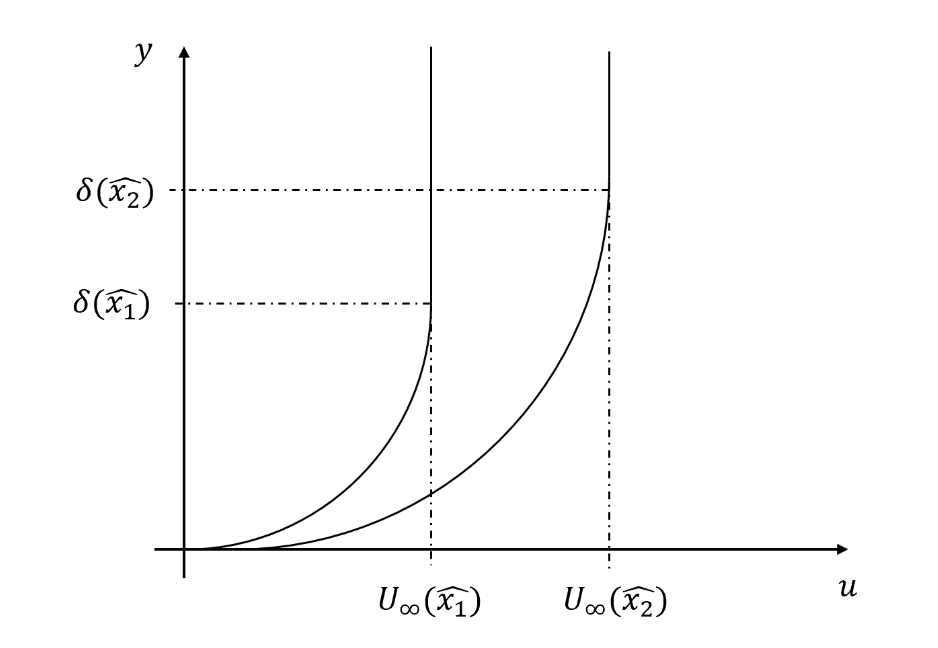
*Figure 13: Sketch of the boundary layer thickness at two different sections.*

As sketched in figure above the velocity profile at $\hat{x}_{2}$ is different for two reasons:
1. The boundary layer thickness changed between section 1 and section 2.
2. In general we also have another factor: the free stream velocity $U_\infty\left(x\right)$ can be variable with $x$ (for example in a channel flow).

The goal is to scale the velocity profile in order to make the two curves collapse one over each other. We need to find a function $h\left(x\right)$ and a function $g\left(x\right)$ such that the velocity profile becomes:

$$
u\left(x,y\right) = \dfrac{u\left(x,\dfrac{y}{h\left(x\right)}\right)}{g\left(x\right)} = u\left(?\right)
$$

At the end of this process, the velocity $u$ is not function anymore of the two variables separately. We know that for $x=\hat{x}_{1}$, after $y = \delta(\hat{x}_1)$ the velocity will be constant. The exact same thing is valid for $\hat{x}_2$. If we take $h(x) = \delta$ and $g(x) = U$ we have just found another fixed point: (1,1). However, we have no guarantee that the two curves coincide even in the region $0< u/U <1$. This is proven to be true if the velocity profile outside varies with a power-law (this is one of the way of modelling the boundary layer): 

$$
U_\infty = Ax^{m}
$$

Finally we found our scaling variables to be:

$$
h\left(x\right) = \delta\left(x\right) = \sqrt{\dfrac{x\nu}{U_\infty}}
$$

$$
\dfrac{y}{\delta\left(x\right)} = f\left(x,y\right) = \eta = y\sqrt{\dfrac{U_\infty}{\nu x}}
$$

The variable $\eta$ is defined as the "similarity variable" and it is the starting point of the Blasius boundary layer solution.

#### The Blasius solution
The Blasius boundary layer is the classical representation of the boundary layer when a flow over a flat plate is considered. Let's go over the case of forced convection, where we do not have the buoyancy term. The boundary layer equations under the hypothesis we have made earlier read as follow:

$$
\dfrac{\partial u}{\partial x} + \dfrac{\partial v}{\partial y} = 0
$$

$$
u\dfrac{\partial u}{\partial x} + v\dfrac{\partial u}{\partial y} = \nu\dfrac{\partial^{2}u}{\partial y^{2}}
$$

The pressure term in this case has been neglected because the free stream velocity $U_\infty$ is constant. Therefore:

$$
-\dfrac{1}{\rho}\dfrac{dp}{dx}=U_\infty\underbrace{\dfrac{dU_\infty}{dx}}_{\text{=0}} = 0
$$

The boundary conditions for the equation above are:
- On the flat solid surface $y=0$ we have:
    1. Impermeability condition: $v=0$
    2. No slip condition: $u=0$
- On the leading edge of the flat plate $x=0$ we have:
    1. $u = U_\infty$ (Free stream flow condition)
- Outside of the boundary layer $y\longrightarrow\infty$ we have:
    1. $u = U_\infty$ (Free stream flow condition)

When we carried out the dimensional analysis on the boundary layer, we saw that $y$ scales with $y\approx\mathcal{L}/\sqrt{Re}$, where the Reynolds number is defined as: $Re = U_\infty\mathcal{L}/\nu$. If this is the scale in which $y$ varies than we can take a fixed position in $x$ and say that the boundary layer thickness at that position will be proportional to:

$$
\delta\approx\dfrac{x}{\sqrt{Re_{x}}}\quad\longrightarrow\quad Re_{x}=\dfrac{U_\infty x}{\nu}
$$

We are hypothesizing that the boundary layer thickness grows with the $\sqrt{x}$, which implies that $\delta$ grows with $x$ (distance from the leading edge). We can evaluate the ratio. Previously we introduced the similarity variable $\eta$, now we can evaluate that variable as:

$$
\dfrac{y}{\delta}\approx\dfrac{y}{x}\sqrt{\dfrac{U_\infty x}{\nu}} = y\sqrt{\dfrac{U_\infty}{\nu x}} = \eta
$$

This is a non dimensional quantity which we named the "similarity variable". The Blasius solution of the boundary layer equations respects the similarity hypothesis, which consists on the assumption that the ratio $u/U_\infty = f\left(\eta\right)$ is a function of the similarity variable. Therefore, inside the boundary layer, the ratio $u/U_\infty$ only depends on $y/\delta$. Under this assumption, the result will be that no matter the location $x$ on the flat plate, the velocity profile will always be similar. However, how do we use the similarity variable in the equations? First of all, as introduced before, we can get rid of the mass equation by introducing the stream function $\Psi\left(x,y\right)$.

$$
u = \dfrac{\partial\Psi}{\partial y}\nonumber\quad v=-\dfrac{\partial\Psi}{\partial x}
$$

$$
\Psi = \int udy + f\left(x\right)
$$

$$
\Psi = \int_{0}^{y} u(x,\overline{y}) d\overline{y} + f(x)
$$

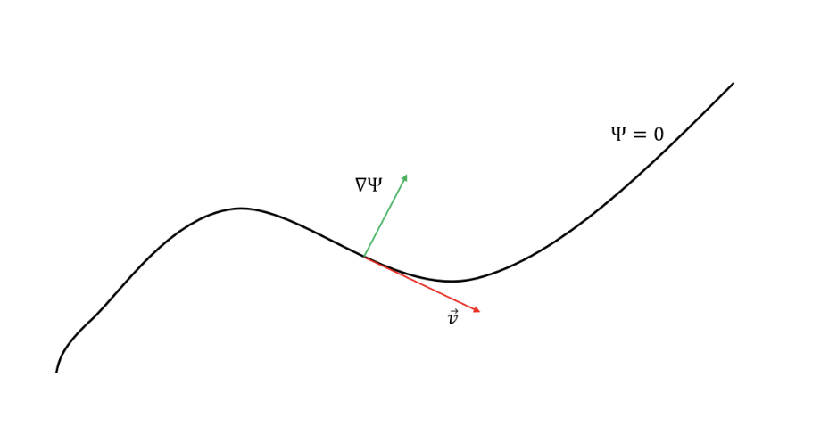
*Figure 14: Sketch of the relation between velocity vector and the gradient of the stream
function.*

Where $\overline{y}$ **is not** the non dimensional variable but just the integration variable. The equation shows that the integral is $0$ when $y=0$. $y=0$ is the position of the solid wall (flat plate) in which we want both the impermeability and no slip conditions. To understand the real implications of the stream function, let's consider a geometric argument: let's take a line at constant $\Psi$. We can easily verify that the gradient $\nabla\Psi$ will be perpendicular to this line.

$$
\vec{u}\cdot\nabla\Psi = u\dfrac{\partial\Psi}{\partial x} + v\dfrac{\partial\Psi}{\partial y}=\dfrac{\partial\Psi}{\partial y}\dfrac{\partial\Psi}{\partial x} - \dfrac{\partial\Psi}{\partial x}\dfrac{\partial\Psi}{\partial y} = 0
$$

This demonstrates that $\vec{u}$ and $\nabla\Psi$ are perpendicular to each other point by point. Also, this tells us that there cannot be flow through a streamline. Every streamline will have a constant value of $\psi$ and more specifically, solid lines such as walls are particular streamlines in which we can assume the stream function is zero.

We now make a very "delicate" hypothesis: the stream function $\Psi$ can be expressed as the product of 2 functions as follow:

$$
\Psi(x,y) = \sqrt{\nu U_\infty x}\cdot f(\eta)
$$

Recall that, by definition, $u=\partial\Psi/\partial y$ and $v=-\partial\Psi/\partial x$, and that the boundary layer equation reads as follow:

$$
u\frac{\partial u}{\partial x} +v\frac{\partial u}{\partial y} = \nu\frac{\partial^2 u}{\partial y^2}
$$

We can now derive the expression of the $u$ velocity component from the stream function:

$$
u=\frac{\partial\Psi}{\partial y} = \sqrt{\nu U_\infty x}\frac{df}{d\eta}\frac{d\eta}{dy} = U_\infty f^{'} 
$$

Similarly we can find the expression for the $v$ component of the velocity:

$$
-v = \frac{\partial\Psi}{\partial x} = f\frac{1}{2}\sqrt{\frac{\nu U_\infty}{x}} - \sqrt{\nu U_\infty x}f^{'}\frac{y}{2x}\sqrt{\frac{U_\infty x}{\nu}}
$$

$$
v = \frac{1}{2}\sqrt{\frac{\nu U_\infty}{x}}\left(\eta f^{'}-f\right)
$$

We now plug everything back to the boundary layer equation:

$$
U_\infty f^{'}\left[-\frac{U_\infty}{2} f^{''}\frac{\eta}{x}\right] + \frac{1}{2}\sqrt{\frac{\nu U_\infty}{x}}\left[\eta f^{'}-f\right]U_\infty f^{''}\sqrt{\frac{U_\infty}{\nu x}} = \nu U_\infty f^{'''}\frac{U_\infty}{\nu x}
$$

With a few algebraic steps we can seplify the equation above to:

$$
-\frac{1}{2}\frac{U_\infty^2}{x} f f^{''} = \frac{U_\infty^2}{x} f^{'''}
$$

$$
f^{'''} + \frac{1}{2} f f^{''} = 0
$$

This equation is known as the Blasius equation, and it is a third order ORDINARY differential equation. The amazing thing about this approach is that we have semplified a second order partial differential equation down to a single ODE with one variable: $f(\eta)$. If we know the similarity function we will be able to calculate both velocity components.

The bad news is that this equation cannot be solved analytically ... however a solution can "easily" be found numerically or asimptotically. The Blasius equation needs 3 boundary conditions:
1. $u=0$ at $y=0$ which becomes $f^{'}=0$ at $\eta=0$
2. $v=0$ at $y=0$ which becomes $f=0$ at $\eta=0$
3. $u=U_\infty$ at $y\rightarrow \infty$ which becomes $f^{'}=1$ at $\eta\rightarrow \infty$ 

With these 3 conditions the Blasius equation can be numerically integrated, and below I report some of the values in table form:

|   $\eta$    | $f(\eta)$ | $f^{'}(\eta)$ | $f^{''}(\eta)$ |
| :--------:  | :-------:   | :--------:      | :-------:        |
| 0         | 0         | 0             |  0.332         |
| 5         | ...       | 0.991         | ...            |
| 8         | 6.729     | 0.999         |  0             |

Using the tabulated values we can now find some (very important!) boundary layer parameters previously introduced. For instance, the boundary layer displacement thickness $\delta^*$:

$$
\delta^{*} = \int_{0}^{\infty}\left(1-\frac{u}{U_\infty}\right)dy = \int_{0}^{\infty}\left(1-f^{'}\right)d\eta\sqrt{\frac{\nu x}{U_\infty}} = 
$$

$$
\delta^{*} = \sqrt{\frac{\nu x}{U_\infty}}\left[\eta - f\right]_{0}^{\infty} \approx 1.72\sqrt{\frac{\nu x}{U}}
$$

In the same way we can find the boundary layer momentum thickness $\theta$ and the wall shear stress $\tau_w$:

$$
\theta \approx 0.664\sqrt{\frac{\nu x}{U_\infty}}
$$

$$
\tau_{w} = 0.332\sqrt{\frac{\rho \mu U^3}{x}} 
$$

**Why are these relations very important?** First, in fluid mechanics is very hard to have analytical solutions. Second, this approach gives us a two dimensional field. In fact, once we know the similarity function $f(\eta)$ we can derive both the $u$ and $v$ velocity components. Finally, this formulation allows us to understand the behavior of physical quantities inside the boundary layer. For instance, it is very important to note (from the table above) that $f^{'}$ tends to 0.99 when $\eta$ tends to 5. Recall that the definition of boundary layer is the **distance from the wall at which the velocity becomes 99% of the freestream velocity**. Following this definition and what we now know about $f^{'}$ we can write:

$$
\delta_{99} \approx 5\sqrt{\frac{\nu x}{U_\infty}}
$$

This is the Blasius solution for the boundary layer thickness. To keep in mind are a couple of things:
1. The definition of the boundary layer thickness contains a level of arbitrariness which is the choice of the 99% value. However the boundary layer displacement thickness $\delta^{*}$ is an integral quantity of the flow with no assumptions whatsoever.
2. The Blasius solution is ONLY valid if $dU_\infty /dx=0$. If we recall that the freestream velocity gradient is connected to the pressure gradient $dP/dx$, we can say that the Blasius solution is only valid for a ZERO PRESSURE GRADIENT boundary layer.

## References
1. Source of original German text: Ludwig Prandtl, “Über Flüssigkeitsbewegung bei sehr kleiner Reibung.” Special issue of the “Verhandlungen des III. Internationalen Mathematiker-Kongresses Heidelberg 1904.”
2. Blasius, H. (1908) The Boundary Layers in Fluids with Little Friction. Zeitschrift für Angewandte Mathematik und Physik, 56, 1-37.
3. Personal notes taken over the years.
