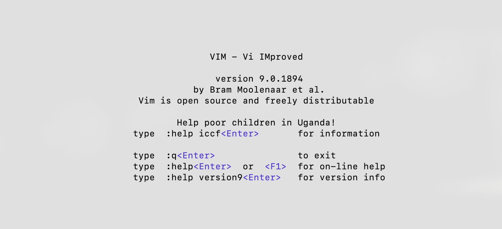
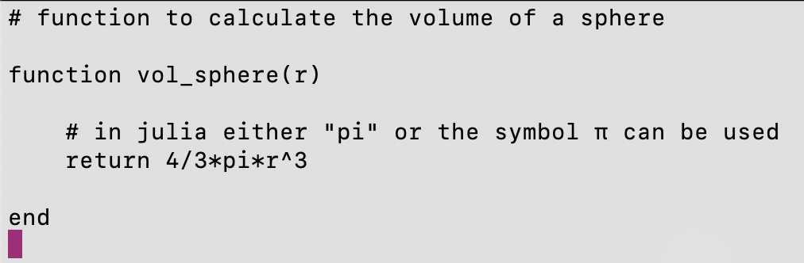
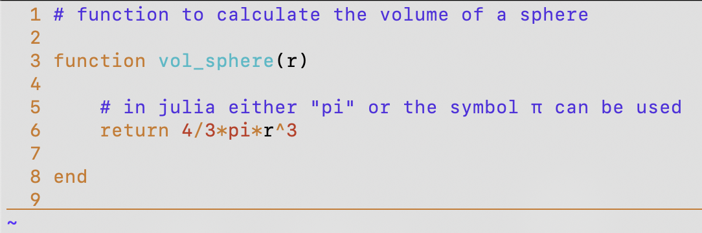
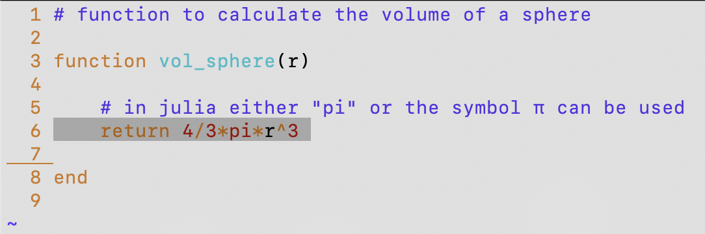
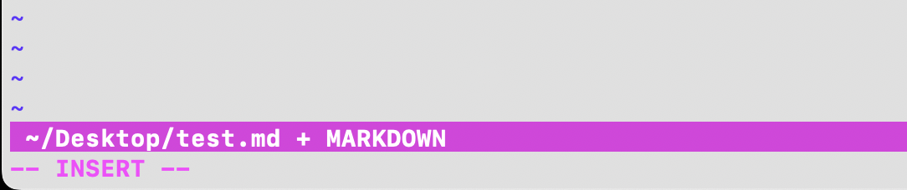
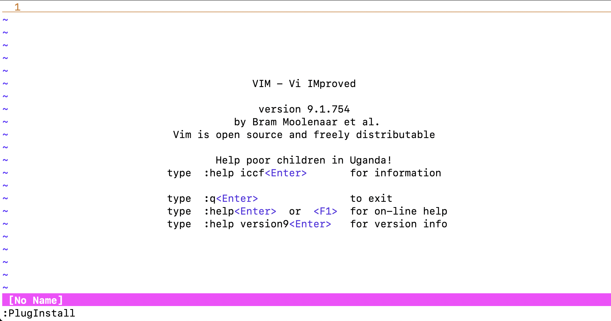
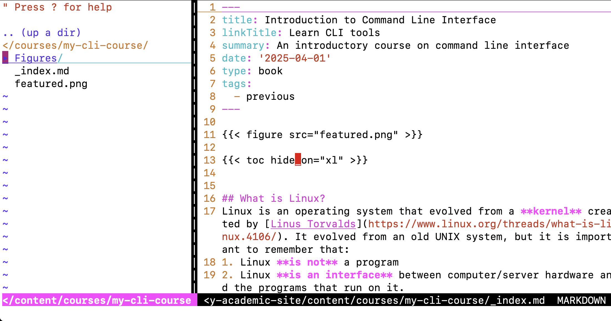
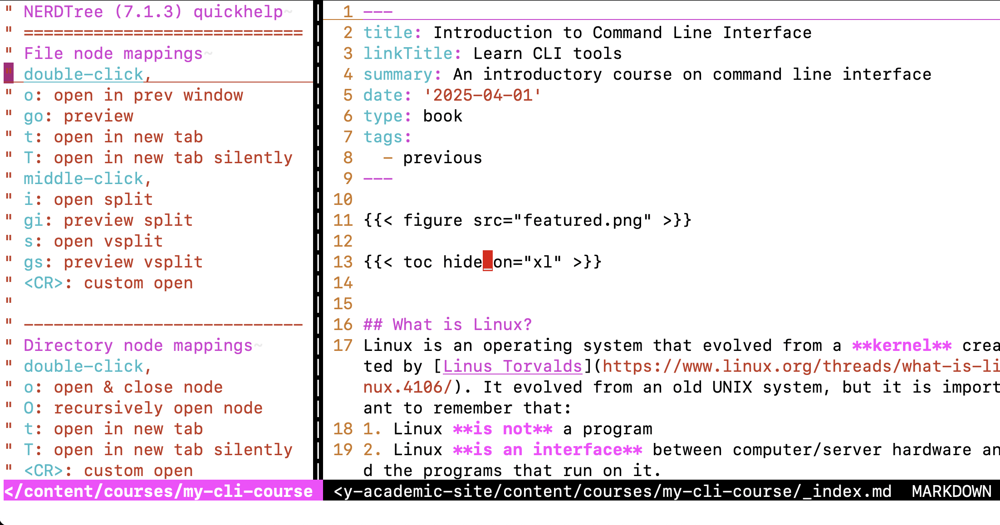





## What is Vim?
Vim (**Vi** **IM**proved) is a completely free, open-source, screen-based text editor developed by [Bram Moolenaar](https://en.wikipedia.org/wiki/Bram_Moolenaar).

## Why you should use Vim?
If you work/study in computational science, chances are you will need to perform numerical simulations on large super-computers by accessing them through **S**ecure **SH**ell connection. Most clusters use Linux as the main operating system and once you are connected to the cluster you will quickly realize that:
1. There is NO graphic interface (in most cases), and all you will see is a terminal window.
2. You will not be able to use your favourite text editor in graphic mode.

Do not dispair! Vim is here to save your life. Vim is, by default, present in almost all Linux distributions. Type <mark>vim</mark> on your command line, and this is the output you should see (the version will depend on your system characteristics):  



The first thing you will realize is that the vim welcome message pops up in the terminal window itself and that, from now on, you can take your mouse (or trackpad) and throw it in the garbage! You might not see it right now, but this is one of the hidden beauties of Vim.

## Quitting Vim, not an intuitive task

Everyone who uses Vim on a daily basis has probably done this joke at least once: go to your mother (or best joke buddy), put them in front of an open Vim screen, and ask them a simple question "Please, can you quit?". After a few seconds you will see the desperation in their eyes, not knowing what is going on, and 98% of the cases they will end up closing the terminal which will kill the entire process.

After this fun intro, here is how you quit Vim: press <mark>:q</mark> (colomn followed by q)

## Give Vim a new look

Right off the bat you might think Vim looks **pretty** boring, especially if compared with recent very fancy text editors (e.g. Atom, VS code, etc.). To give you an idea, here is a simple function (witten in Julia) to calculate the volume of a spehere:



If you are ready to give up Vim because of its look (at first), I totally understand. However, let's not judge the book from its cover, and take a look at this:




Much better, right?? We have now highlighted syntax for different programming languages, we have line numbers, automatic indentation, and it underlines where you currently are with the cursor (which in Vim is pretty crucial). So how do you make these changes in Vim? Again, this is not intuitive. There is no dropdown settings menu where you can edit all the perks. 


At start-up vim automatically reads a config file called <mark>vimrc</mark>. This is the equivalent of your <mark>bashrc</mark> file for your terminal. If you just installed Vim or if you are a brand new user, chances are you do not have this file, so the first thing to do is to create the file at home: <mark>touch ~/.vimrc</mark>

Inside this file you can now put all your precious settings to make Vim look very fancy, probably even better than mine. Here is a selection of settings which I believe will be useful for any Vim user:

```vim
set nocompatible
filetype on
filetype indent on
syntax on
set number
set cursorline
```

From top to bottom: **nocompatible** fixes compatibility problems between Vi and Vim, **filetype on** makes sure Vim recognizes the file by the extension and syntax, **indent on** follows indentation rules set by the given programming language, **syntax on** highlights keywords and functions based on the given programming language, **set number** put the line number on the left side, and **set cursorline** underlines the location where the cursor is. 

## Four VIM modes

The most important thing to realize as soon as Vim starts up is understand in what **mode** is working. There are **4 MAIN** modes:
1. __Normal__: normal mode is the default start-up mode for Vim. This mode is read-only and you will be unable to edit the file. Very useful when consulting or studying a piece of code. 
2. __Insert__: upon pressing <mark>i</mark> you will enter **insert mode**. In this mode you will be able to freerly edit the file. Insert mode can also be activated by pressing <mark>INS</mark> on a full-size keyboard. Two very useful sub-commands are: <mark>a</mark> will turn on instert mode and move the cursor after the current character. <mark>o</mark> will turn on insert mode and move the cursor one line below.
3. __Visual__: this mode allows you to visually highlight (slect) text areas and perform operation (cut, copy, move) on them. Press <mark>v</mark> to enter visual mode which will mark the beginning of the selection. You can use the arrow keys to highlight the desired text.
4. __Command line__: this mode will allow you to perform operations such as: quit, save, replace, and search. Enter the command line mode by typing <mark>:</mark> within **normal mode**.
 
**Example**: let's take the piece of code shown before, and let's highlight only the formula for the volume of the sphere. You would put the cursor on that line, then press <mark>v</mark> and move the cursor to the next line pressing <mark>&#8595;</mark>. Here is the result:



<u>**The golden rule**</u>: if you do not know in which mode you are in, or if you want to go back to **normal mode** just press <mark>ESC</mark>. You will find that when you will be more used to using Vim, the <mark>ESC</mark> key will be on of the most used on your keyboard.

<u>**The status bar**</u>: a pretty awesome tool that will give you useful information on the file you are editing with Vim. The status bar is situated at the bottom of the file and (in my case) looks like this:



In this case the status bar tells me that: I am in **insert mode**, and I am modifying the file named **test.md** located in **~/Desktop/**, and finally that the file is of type markdown. To setup the status bar like I did, here are the changes that must be included in the ~/.vimrc file:

```vim
set statusline=
set statusline+=\ %F\ %M\ %Y\ %R
set statusline+=%=
set laststatus=2 
``` 

## The 5 basics Vim commands to get by
Here are (in my opinion) the 5 basic commands to use Vim on a daily basis as a beginner.

1. <u>The save command</u>: suppose you are now in insert mode (after typing <mark>i</mark>, <mark>o</mark>, <mark>a</mark>, or <mark>INS</mark> in a full size keyboard) and say that you are happy and want to save the changes to your file, the command to save is <mark>:w</mark> and <mark>ENTER</mark>. If you want to save and quit Vim, you would just type <mark>:wq</mark> and press <mark>ENTER</mark>.

2. <u>The undo command</u>: suppose you made some changes, but want to go back, NOT A PROBLEM: within a session Vim keeps track of your changes and you can go back by pressing <mark>u</mark> until the oldest change.

3. <u>Navigation keys</u>: Vim is designed to improve your productivity while writing codes. You don't need to use arrow keys (usually placed on the far right of your keyboard) to navigate your code. Withing **normal mode** you can move around using <mark>h</mark> (left), <mark>j</mark> (down), <mark>k</mark> (up), <mark>l</mark> (right). Practice using these keys instead of the arrows and you will never regret it!

4. <u>Delete line command</u>: you can delete an entire line by typing <mark>dd</mark> within normal mode. This command will delete the line the cursor is sitting at.

5. <u>The search command</u>: there are a few ways in which you can **search** in Vim. If you activated the line number, you can go directly to a specified line number <mark>#</mark> by typing<mark>:#</mark> and <mark>ENTER</mark>. You can also perform a word search by typing <mark>/</mark> followed by the word you are searching for. If you press <mark>ENTER</mark> Vim will go to the word you searched that is below and closest to the cursor. At that point if you type <mark>n</mark> repeatedly Vim will jump to every location in the code where that word appears. When you reach the bottom of the code Vim will pop a message in the status bar "search hit BOTTOM, continuing at TOP" and will move to the top of the file. By default, search words are not highlighted and the search is case sensitive, if you want to highlight the word and ignore the upper or lower case letters here are the changes you need to add to the <mark>~/.vimrc</mark> file:

```vim
set incsearch
set ignorecase
set hlsearch
``` 

## Vim plugins (is this magic?)

As I mentioned in the beginning Vim is an EXTREMELY powerful editor, plugins are the heart of its beauty. You can customize your Vim editor based on your typical workflow by installing plugins. Below I will give you **ONE** of the ways to install plugins in Vim, and I will provide a list of very useful (in my opinion) plugins to install. Buckle up!

### Setting up plug-ins
In order to set up plugins in Vim we are going to need the <mark>curl</mark> command. First order of business is therefore to check if we have the <mark>curl</mark> command installed in our system by typying:
```bash
francesco@rafaela : (~) -> which curl
/usr/bin/curl
francesco@rafaela : (~) ->
``` 
If the output of <mark>which</mark> is "similar" to what you see above, you are all set to continue and unleash the power of vim plugins!

### Use vim.plug to install plugins
There are many possibilities to install plugins in Vim, but I believe vim.plug is probably one of the most straight forward. Carefully follow these steps:

First, we are going to create a <mark>~/.vimrc.plug</mark> file in our home directory. Very similar to <mark>~/.vimrc</mark>, this file will contain ALL installed plug-ins. 
```bash
francesco@rafaela : (~) -> touch ~/.vimrc.plug
```
We are now going to create a hidden directory <mark>.vim/plug</mark> in our home. Recall that hidden directories and files in unix based systems start with a "dot". We will also use the <mark>-p</mark> option to create the parent directory as well.
```bash
francesco@rafaela : (~) -> mkdir -p ~/.vim/plug
```

We now have to tell vim to "source" the <mark>~/.vimrc.plug</mark> file at each startup. To do so we will add the following code at the bottom of the <mark>~/.vimrc</mark> file:
```vim
" Call the vimrc.plug file
if filereadable(expand("~/.vimrc.plug"))
    source ~/.vimrc.plug
endif
```
The last step in this module is to install vim.plug itself. We will do so with the <mark>curl</mark> command as mentioned above.
```bash
curl -fLo ~/.vim/autoload/plug.vim --create-dirs https://raw.githubusercontent.com/junegunn/vim-plug/master/plug.vim
```
When this is done, you should be all set to navigate the web and install whatever vim plugin will makre your workflow more efficient. Below, I will show you my 3 **must have** vim plugins.

### My 3 must have plugins
The three plugins I will present are:
1. [**Fugitive**](https://github.com/tpope/vim-fugitive): the main feature of Fugitive is :Git (or just :G), which calls any arbitrary Git command. If you know how to use Git at the command line, you know how to use :Git. It's vaguely akin to :!git but with numerous improvements. 

2. [**NERD Tree**](https://github.com/preservim/nerdtree): the NERDTree is a file system explorer for the Vim editor. Using this plugin, users can visually browse complex directory hierarchies, quickly open files for reading or editing, and perform basic file system operations.

3. [**VimTex**](https://github.com/lervag/vimtex): VimTeX is a modern Vim and Neovim filetype and syntax plugin for LaTeX files.

To install these plugins we are going to open the previously created <mark>~/.vimrc.plug</mark> file and type the following:

```vim
call plug#begin('~/.vim/plugged')

" Fugitive plugin
Plug 'tpope/vim-fugitive'

" NERD tree plugin
Plug 'preservim/nerdtree'

" VimTex plugin
Plug 'lervag/vimtex'

call plug#end()
```

The VERY LAST step is to open up vim, press <mark> : </mark> to go in **command line** mode and type <mark>PlugInstall</mark> and hit ENTER (see figure below):



The output of this command should look something like this:
```vim
Updated. Elapsed time: 1.457243 sec.                                                        
[===] 
- Finishing ... Done!
- vimtex: Already up to date.
- vim-fugitive: Already installed
- nerdtree: Already up to date.
```

And the MAGIC IS DONE!

### Example
I will let you explore the different plugins we have installed by yourself, but I will  show you an example on how to use **NERD Tree**. Let's open a random file using Vim (I will use a file from one of my [intro to command line course](https://francescoambrogi.github.io/courses/my-cli-course/)). After the file is opened in vim, enter **command line** mode (you should know how to do it by now) and type <mark>NERDTree</mark>. What you should see is something like this:



The file is still open on the right side, but you have a BEAUTIFUL side bar showing all files in the current directory. You can navigate the side bar menu with your mouse or with the keyboard, check files and directories, and even open more than one file at once. If you type <mark> ? </mark> you will have an entire list of possible commands for NERDTree. 



This is FAR beyond a complete course on Vim text editor, but just a quick showcase of useful commands that may spark your curiosity to use this wonderful tool. Keep checking as I will add more sections soon ...
